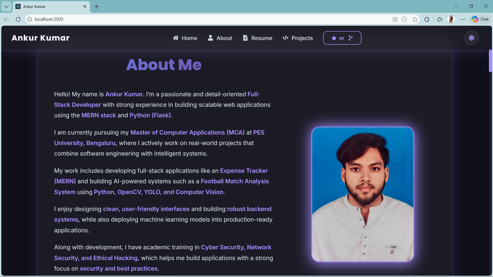
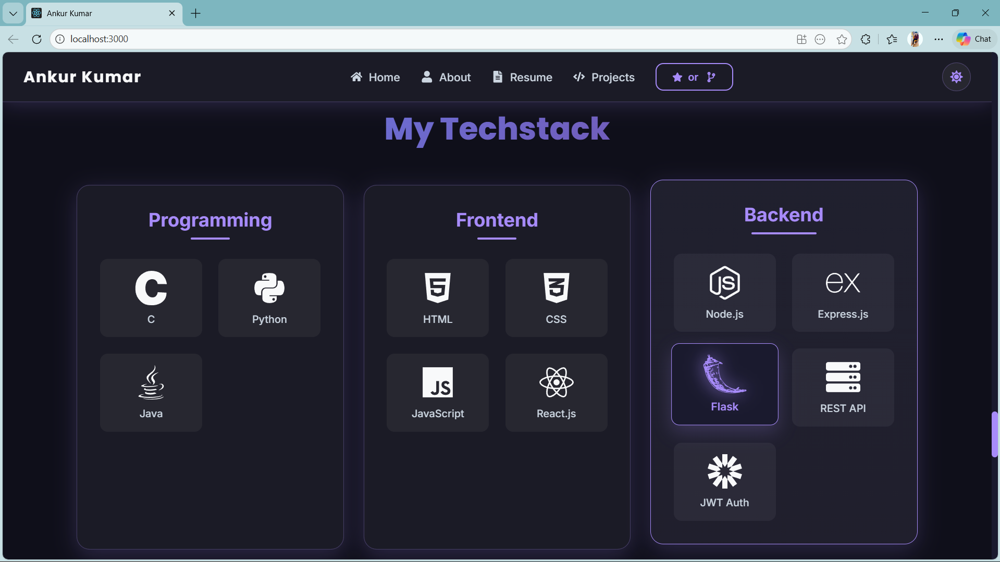
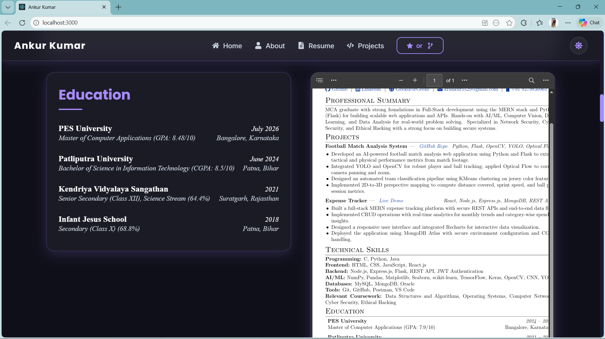
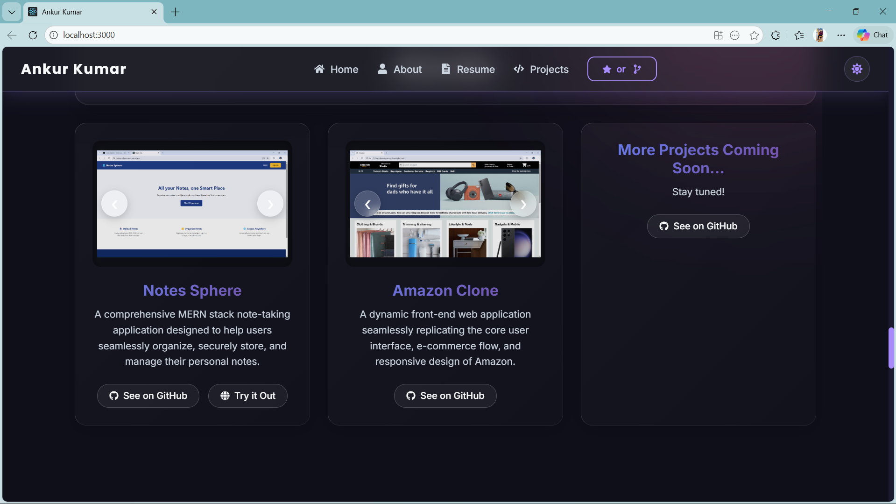
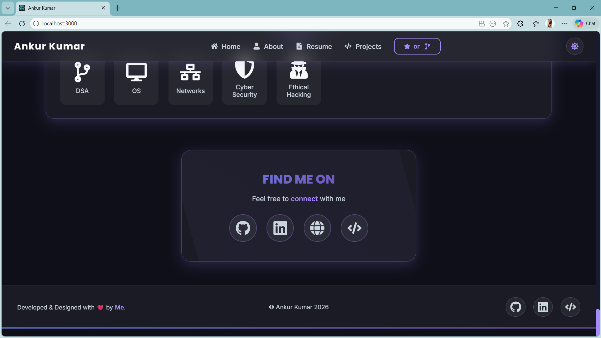

# Ankur Kumar - Personal Portfolio Website

Welcome to my personal portfolio repository! This responsive and stylish web application showcases my projects, skills, education, and experience as a Full-Stack Developer. It's built with modern web technologies including React, TypeScript, and Styled-Components to provide an engaging, high-performance user experience.

🌐 **Live Demo:** [Portfolio Website](https://Ankur5529.github.io/Portfolio-website)

## 🚀 Features
- **Dynamic Projects Showcase:** Interactive media sliders to view project screenshots and videos.
- **Glassmorphism Design:** Modern aesthetics with blurred translucent backgrounds and colorful glowing gradients.
- **Fully Responsive Navigation:** Optimized for mobile phones, tablets, and desktop views.
- **About & Education:** A neat timeline summary of my academic journey and technical expertise.
- **Easy Contact Integration:** Direct links to my professional profiles (GitHub, LinkedIn, GeeksForGeeks).

---

## 📸 Screenshots

### Home Page


### About Section


### Tech Stack


### Education


### Projects


### Footer & Social Links


---

## 🛠️ Built With

- **ReactJS** - Frontend Javascript library
- **TypeScript** - For type-safe robust code
- **Styled-Components** - For component-level CSS and dynamic styling (Glassmorphism & animations)
- **Framer Motion** & Custom CSS Animations - For smooth scrolling interactions

## 🏃‍♂️ Running Locally

To get a local copy up and running, follow these simple steps:

1. **Clone the repository:**
   ```bash
   git clone https://github.com/Ankur5529/Portfolio-website.git
   ```
2. **Navigate to the directory:**
   ```bash
   cd Portfolio-website
   ```
3. **Install dependencies:**
   ```bash
   npm install
   ```
4. **Start the development server:**
   ```bash
   npm start
   ```
   *The site will open automatically at http://localhost:3000*

## 📬 Contact
**Ankur Kumar**  
- [LinkedIn](https://www.linkedin.com/in/ankur-kumar-b3aba931a)
- [GitHub](https://github.com/Ankur5529)
- [GeeksForGeeks](https://www.geeksforgeeks.org/profile/kranku36wo)

Feel free to reach out to me!
